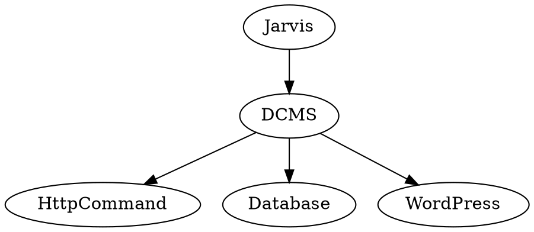
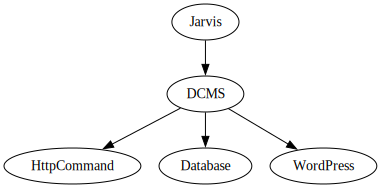

# Specification
This document describes the system.

- [Startup](#startup)
- [Data Refresh](#data-refresh)

## Boundaries

## Startup
Startup sequence involves calling the `Run` function with a debug flag. The debug flag determines error trapping behaviour.

|Value|Behaviour|
|---|---|
|0|All errors are trapped and the server responds 500.|
|1|Expected errors are trapped and respond 500. Unexpected errors suspend execution.|
|2|All errors suspend execution|
|>2|The APL system throws DOMAIN ERROR and the server does not start.|

### Server start
The Jarvis server starts when the Run function is called. The server debug flag is `0` (all errors trapped and respond 500) if the DCMS debug flag is `0`, else it is `1`.

## Data Refresh
The system may start from an empty database or a pre-existing one. Either way, the data refresh occurs at startup. Data refresh can also be triggered from a Jarvis endpoint once the server is running.

1. YouTube Fetch
If there are videos in the videos table, requests are made to the YouTube API to retrieve up to date descriptions and thumbnails for those videos.

1. Build Cache from Database
Data from the database is joined into an index for querying and objects for quickly responding to requests made to the server.

1. Push Custom Posts to WordPress
The system updates video listings for Team Dyalog member pages on the WordPress site.
