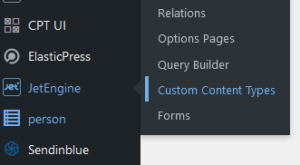
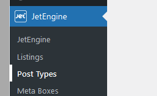
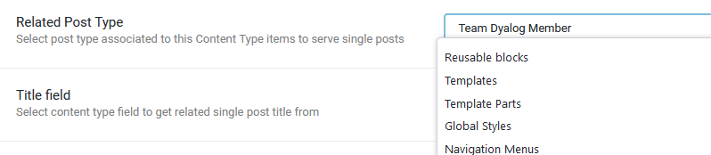
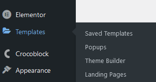
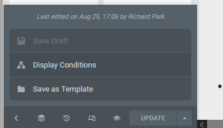
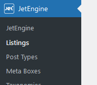

# WordPress synchronisation
Some pages and widgets on wordpress are to be generated programmatically from data stored in DCMS. For example, the Team Dyalog grid/list and individual `/team-dyalog/` pages are generated in this way.

## How DCMS data becomes a WordPress Page
We *push* data up to wordpress via its REST API, to populate some fields in a JetEngine Custom Content Type (CCT). 

These CCTs have a JetEngine Post Type as their Related Post Type.

There is a Template for each of these page types.

The template has conditional display for a JetEngine Post Type. Click on the arrow next to the **PUBLISH/UPDATE** button and click **Display Conditions**. Choose **INCLUDE** the Post Type (e.g. Team Dyalog Member) and the custom fields should become accessible from within. 

We can now relate information for that specific page / DCMS API record. 

We will only use the Title (e.g. team member name) and `dcms_id` (ID into the DCMS backend database table, e.g. the `person` table).

The majority of the dynamic data is actually pulled from the DCMS API using a JetEngine REST API Endpoint and Custom Query.

    
    

!!!Note "Why don't we just use the Custom Content Type Fields in the Dynamic Tags in Elementor?"
    Although it is possible to push all of the fields from DCMS database to the Custom Content Type and use them directly within the Template as Dynamic Tags → Custom Content Type Fields, it is more flexible if we only supply a minimal amount of identifying information (namely the ID into the DCMS database table) and then use that to fetch a REST API listing. That way, if we update what kinds of fields are available, we do not need to also update the CCT fields.

A JetEngine Listing is where the arrangement and styling for displaying the data on the website occurs.

This Listing can then be included in the Template as an Elementor Listing Grid widget.

!!!Note "Why can't I see anything in the Listing or Template?"
    The JetEngine Listings item for a REST API endpoint has an example visible in Elementor when editing, whereas a Listings item for a Query Builder query does not.

    For a single page, it is best to create a static template, and then copy the structure into a Query Builder Listings item where the widgets content can be replaced with Dynamic Tags → Query Builder items.

    For a page showing a list or grid of items, you might get good results using a Listing from a REST API Endpoint.

## Push data from DCMS to WordPress via REST
A custom content type contains the ID into the relevant SQL table. For example, the `person` CCT contains fields:

- `_ID` (ID in WordPress jet-cct table), 
- `dcms_id` (ID into `person` endpoint in DCMS API)
- `name` (Name just for easy manual identification for debugging)

This data is pushed to WordPress via the REST API in the `#.DCMS.wp_` namespace. The data is simply supplied as JSON.

The `/refresh` endpoint can be used to trigger a rebuild of the API data and an update of wordpress CCT items. 

### Authentication
A WordPress user `DCMS` has permission to edit others' posts. This Access Capabilitiy (`edit_others_posts`) is set in the settings for the Custom Content Type. You can create a password (`#.GLOBAL.api.wordpress_token` in the [secrets](secrets.md)) from Wordpress via **Users → Profile → Application Password**.

